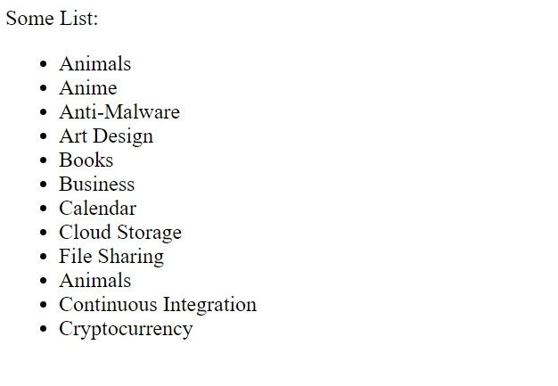

[](https://classroom.github.com/a/bEfCpjtQ)
# React online marathon

## The tasks of the topic "Keys"

There is the component <code>App</code>

Write code to provide:

1. Display in the component <code>App</code> the next list:
```txt
Animals
Anime
Anti-Malware
Art Design
Books
Business
Calendar
Cloud Storage
File Sharing
Animals
Continuous Integration
Cryptocurrency
```
2. Use the element <code>li</code>  to represent an item in a list
3. Provide some unique keys to render this list, but don't use the index of an item as its key

### Example

