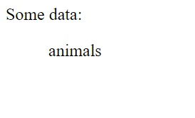

[](https://classroom.github.com/a/9dJJb7jl)
# React online marathon

## The tasks of the topic "Props"

There are two components - <code>App</code> and its children component <code>First</code>

Write code to provide:  

1. Using the <code>props</code> the component <code>App</code> passes into the component <code>First</code> the list converted into lowercase: 
```txt
Animals
Anime
Anti-Malware
Art Design
Books
Business
Calendar
Cloud Storage
File Sharing
Animals
Continuous Integration
Cryptocurrency
```
2. The component <code>First</code> renders the first (is at index 0) element of the array received in props.

### Example

